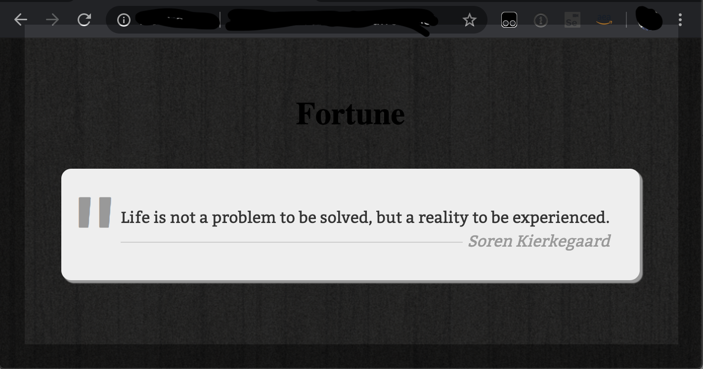

# Fortune API

The good-ol fun UNIX fortune command, re-implemented as a RESTful API that returns a famous quote. 
Built on AWS API Gateway, Golang, with MySQL, ElasticSearch, and Redis back-ends. Runtime was initially EC2 Autoscaling, later added containerized on EKS.

## Architecture

## Setup Networking and Databases 

These resources are currently manually created via CLI or AWS Console and Makefiles:

* VPC, bastion host.
* Amazon Aurora MySQL, 
* Elasticache Redis, 
* Elasticsearch

Load sample data. See readmes in [./fortune-data](./fortune-data)

## Setup Application.

Provisions application resources in the **service** demo VPC. 

See [./cdk](./cdk)

## Setup API Gateway.

Setup HTTP API here [./fortune-api](./fortune-api)

## Demo outline.

1. Amazon CloudWatch Dashboards (1m)
    
    Or, use your preferred monitoring front-end from partners such as DataDog, New Relic, Dynatrace, Splunk, or open-source ElasticSearch/Kibana dashboards, or Grafana dashboards. The monitoring concepts will still apply.
    
    Things to point out: ...
    * CW Health Dashboards
        * Health Metrics: Volume (sum?), Faults (sum), Errors (sum), Latency (p50 median, p90,p99). 
        * Timescale. Zoom out to see a different periodic pattern.

    * CW Diagnostic Dashboards
        * EC2: 
            * CPU, Network IO, Disk IO
            * CW Agent: Memory, Disk
        * ... additional compute runtimes?
        * RDS
        * Elasticache REDIS
        * ElasticSearch

2. Amazon CloudWatch composite alarms. (1m)

    Reduces alarm noise.

    Composite Alarm on multiple Health Metrics:
    
    * Intermittent 4xx Errrors, unauthorized or forbidden? 
        * Authentication problems for 1 specific user? (Check if Feasible??)
        * API Gateway metric across 2 or more services.
    * 100% 5xx Faults due to misconfigured DB Security Group?
    * Intermittent 5xx Faults due to database latency?

    Composite Alarm on multiple Diagnostic Metrics. Establish a baseline threshold for each.

    * EC2 / ASG: CPUUtilization + NetworkOut + DiskReadBytes
    * NLB: ActiveFlowCount + UnHealthyHostCount
    * RDS
    * ElastiCache
    * ElasticSearch

3. Amazon CloudWatch Synthetics. (1m)
    Continual Testing in production.
    * 3 API canaries.
    * 1 browser canary
 
    * Canary load tester: Top of hour, Office hours vs evening, Weekday vs weekends.

4. CW custom metrics
    * 

5. Amazon CloudWatch Log Insights - logdive troubleshooting

6. Amazon X-Ray performance monitoring - X-Ray

## TODOs:
* CloudWatch Sythetics Canary Recorder Chrome plugin + Amplify client
* Additional runtimes
    * ECS Runtime
    * Lambda
    * Step Functions
* Cloudwatch Embedded Metric Format. supports Python,Node,Java, not Golang.
* Improve error handling / retries, to recover gracefully and avoid crashes. Diagnostic logs:
    * ElasticSearch handler possibly hangs after message: "Error parsing the response body: invalid character '}' looking for beginning of object key string"
    * ElasticSearch handler possibly hangs after message: "doc _source: map[string]interface {}"
    * Redis handler possibly hangs after message: "DBSize: XXXXXX, random ID:YYYYYY"

## Footnote

The Swish Machine: 70 Step Basketball Trickshot (Rube Goldberg Machine)
https://www.youtube.com/watch?v=Ss-P4qLLUyk

