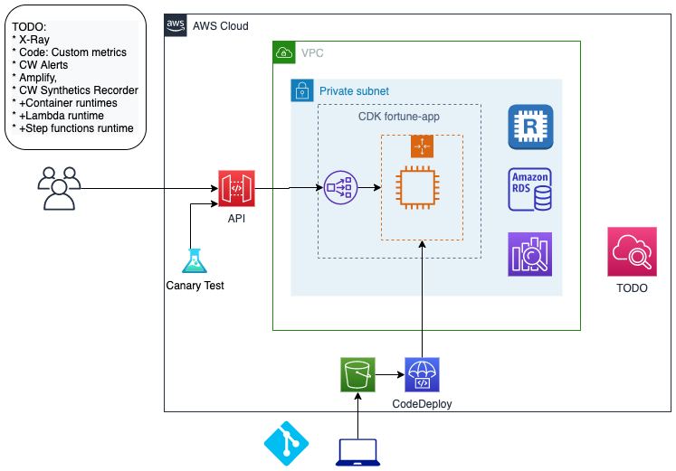

# Demo service resources

## Architecture

## Fun
The Swish Machine: 70 Step Basketball Trickshot (Rube Goldberg Machine)
https://www.youtube.com/watch?v=Ss-P4qLLUyk

## Setup Networking and Databases 

These resources are currently manually created via CLI or AWS Console and Makefiles:

* VPC, bastion host.
* Amazon Aurora MySQL, 
* Elasticache Redis, 
* Elasticsearch

Load sample data. See readmes in [./fortune-data](./fortune-data)

## Setup Application.

Provisions application resources in the **service** demo VPC. 

See [./cdk](./cdk)

## Setup API Gateway.

Setup HTTP API here [./fortune-api](./fortune-api)
